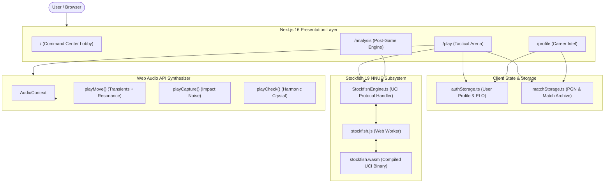

# ⚡ NEXUS // CHESS

<div align="center">


<br/>

**A Next-Generation Cyberpunk Chess Command Center & WebAssembly UCI Engine Arena**

[](https://nextjs.org/)
[](https://react.dev/)
[](https://www.typescriptlang.org/)
[](https://tailwindcss.com/)
[](https://stockfishchess.org/)
[](https://developer.mozilla.org/en-US/docs/Web/API/Web_Audio_API)
[](LICENSE)

<br/>

[✨ Features](#-key-features) • [🧠 Engine & Bots](#-20-tier-stockfish-engine-matrix) • [🏗️ Architecture](#-system-architecture) • [🚀 Getting Started](#-getting-started) • [👨‍💻 Author](#-author--creator)

</div>

---

## 📖 Overview

**NEXUS // CHESS** is a high-performance, cyberpunk-themed chess battleground engineered for grandmaster-level tactical computation and immersive web gameplay. 

Built with **Next.js 16 (App Router)**, **React 19**, and **TailwindCSS v4**, Nexus Chess bundles a dedicated Web Worker running a **Stockfish 19 NNUE WebAssembly** engine directly inside the browser. It delivers up to **3500+ ELO** depth with zero server latency, offline play capability, real-time positional evaluations, and post-game computer analysis.

A custom procedural **Web Audio API** sound engine generates organic acoustic wood impacts, captures, and check alerts without downloading external audio files.

---

## ✨ Key Features

### 🎮 Tactical Play Arena (`/play`)
- **Stockfish 19 NNUE in WASM**: Official Stockfish compiled to WebAssembly running inside an isolated Dedicated Web Worker for 60fps UI responsiveness.
- **Dynamic Centipawn Eval Bar**: Live advantage computation with instant turn normalization and mate-in-N detection.
- **Master Opening Book**: Embedded ECO theoretical database automatically identifying standard lines (Sicilian Najdorf, Ruy Lopez, King's Indian, Queen's Gambit, English, etc.).
- **Live Move Notation**: PGN recording, SAN notation, algebraic coordinate cues, and capture material advantage counter.
- **Interactive Bot Banter & Chat**: Real-time contextual trash talk, tactical observations, and quick-reply emotes.
- **Player Timer Engine**: High-frequency countdown clock with customizable increments and flag-fall auto-forfeit detection.

### 🔬 Post-Match Analysis Suite (`/analysis`)
- **Move Classification Engine**: Distinguishes Brilliant, Best, Excellent, Good, Inaccuracy, Mistake, and Blunder moves.
- **Interactive Move Navigation**: Step backward, forward, jump to start/end, or auto-play through move trees.
- **Branch Exploration**: Play alternative variations directly on the board and evaluate counterfactual lines.
- **Accuracy / CAPS Scoring**: Algorithmic performance metrics assessing positional accuracy across the entire match.

### 🔊 Procedural Acoustic Sound Engine
- **Pure Web Audio API Synthesis**: 100% generated in real time — zero external MP3/WAV network dependencies.
- **Acoustic Wood Physics**: Dual-band sound modeling with high-frequency contact transients (1400Hz) and low-frequency resonant wood body decay (190Hz → 130Hz).
- **Harmonic Signals**: Elegant crystalline check chime harmonics and cinematic ambient game-over chords.

### 🎨 Cyberpunk Staunton Visual System
- **Handcrafted Vector Pieces**: Custom SVG Staunton silhouettes rendered in porcelain white with cyan neon luminescence and deep obsidian purple.
- **Zero-Scroll Viewport**: Strict responsive command center fitting within 100vh on desktop screens.
- **Visual Cues**: Legal move target rings, capture highlights, in-check emergency halos, and last-move indicators.

### 👤 Career Profile & Persistent Local Storage (`/profile`)
- **Career Analytics**: Live win/loss/draw counters, win rate percentages, and rating progression.
- **Match History Archive**: Complete records of past games with opening names, accuracy scores, opponents, and dates.
- **Local Identity Management**: Seamless profile customization, cyberpunk avatars, and guest persistence via `useSyncExternalStore`.

---

## 🧠 20-Tier Stockfish Engine Matrix

Nexus Chess provides a 20-level graduated difficulty matrix powered by Stockfish's UCI `Skill Level`, search depth, and move-time caps:

| Tier | Bot Name | Level | ELO | Depth | Move Time | Playstyle & Characteristics |
|:---|:---|:---:|:---:|:---:|:---:|:---|
| **Novice** | `NEO_ROOKIE` | 1 | 800 | 3 | 200ms | Frequent hanging piece blunders; basic single-move focus |
| | `SPROUT_CORE` | 2 | 920 | 3 | 250ms | Basic piece captures; prone to early Queen traps |
| | `BIT_RUNNER` | 3 | 1050 | 4 | 300ms | Standard opening principles; vulnerable to Knight forks |
| | `PULSE_CADET` | 4 | 1180 | 4 | 350ms | Develops minor pieces; occasional tactical oversights |
| | `CYBER_PAWN` | 5 | 1300 | 5 | 400ms | Consistent castling; struggles with complex pawn breaks |
| **Tactical** | `CIRCUIT_SCOUT` | 6 | 1420 | 5 | 420ms | Solid intermediate tactical awareness; calculates 2-ply lines |
| | `LOGIC_RAIDER` | 7 | 1550 | 6 | 450ms | Aggressive tactical strikes; punishes uncastled kings |
| | `PROTO_AGENT` | 8 | 1680 | 7 | 480ms | Sound opening theory; strong rook file utilization |
| | `NEXUS_VIPER` | 9 | 1820 | 8 | 500ms | Sharp tactical eye; spots multi-piece combinations |
| | `VECTOR_BLADE` | 10 | 1950 | 9 | 550ms | Rapid piece mobilization; dangerous kingside attacks |
| **Expert** | `SENTINEL_AI` | 11 | 2050 | 10 | 580ms | Advanced positional restraint; active king safety |
| | `MATRIX_WARDEN` | 12 | 2150 | 11 | 600ms | Deep mastery of pawn structure imbalances and weaknesses |
| | `NEURAL_KNIGHT` | 13 | 2280 | 12 | 650ms | Precise tactical calculation in messy, double-edged games |
| | `APEX_TACTICIAN` | 14 | 2400 | 13 | 700ms | Candidate Master caliber; virtually zero unforced errors |
| | `VALKYRIE-09` | 15 | 2550 | 14 | 750ms | International Master strength; ruthlessly sharp tactical conversion |
| **Grandmaster**| `SYNAPSE_OVERLORD` | 16 | 2700 | 15 | 800ms | Grandmaster tier; impenetrable endgame technique |
| | `CHRONOS_PRIME` | 17 | 2880 | 16 | 850ms | Super GM prophylactic master; snuffs out counterplay early |
| | `DEEP_NEXUS` | 18 | 3050 | 17 | 900ms | Superhuman piece coordination and dynamic speculative sacrifices |
| | `ZERO_ZENITH` | 19 | 3250 | 18 | 950ms | World Champion strength; near-flawless engine precision |
| | `STOCKFISH MAX` | 20 | 3500+ | 20 | 1000ms | Full unconstrained NNUE neural network; omniscient play |

---

## ⏱️ Time Control Presets

Choose from 12 official FIDE & online tournament time controls:

- **Bullet**: `1 + 0` (Hyper), `1 + 1` (Increment), `2 + 1` (Dynamic)
- **Blitz**: `3 + 0` (Classic), `3 + 2` (Arena Tournament Standard), `5 + 0` (Blitz), `5 + 3` (Master)
- **Rapid**: `10 + 0` (Standard), `15 + 10` (Precision), `30 + 0` (Classical Rapid)
- **Classical**: `60 + 0` (Classical Hour), `90 + 30` (FIDE Championship Standard)

---

## 🏗️ System Architecture



---

## 💻 Tech Stack

- **Framework**: [Next.js 16.3](https://nextjs.org/) (App Router, React Server Components ready)
- **Library**: [React 19.2](https://react.dev/)
- **Language**: [TypeScript 5](https://www.typescriptlang.org/) (Strict type checking)
- **Styling**: [TailwindCSS v4](https://tailwindcss.com/) + Custom Glassmorphic Design System
- **Chess Logic**: [chess.js](https://github.com/jhlywa/chess.js) v1.4
- **Chess Engine**: [Stockfish 19](https://stockfishchess.org/) (WebAssembly NNUE Worker build)
- **Icons**: [Lucide React](https://lucide.dev/)
- **Audio**: Web Audio API (Synthesized procedural acoustics)

---

## 📁 Project Structure

```
nexus-chess/
├── public/
│   ├── stockfish.js          # Stockfish UCI web worker loader
│   ├── stockfish.wasm        # Stockfish 19 NNUE WebAssembly binary (1.8 MB)
│   └── ...
├── src/
│   ├── app/
│   │   ├── analysis/         # Post-match deep analysis & CAPS scoring
│   │   │   └── page.tsx
│   │   ├── play/             # Core real-time chess arena against Stockfish
│   │   │   └── page.tsx
│   │   ├── profile/          # Career stats, rating badges & history
│   │   │   └── page.tsx
│   │   ├── globals.css       # Design tokens, neon glow & glassmorphism
│   │   ├── layout.tsx        # Root HTML layout & font configurations
│   │   └── page.tsx          # Nexus Command Center & match launcher
│   ├── components/
│   │   ├── AuthModal.tsx      # Cyberpunk profile & authentication modal
│   │   ├── ChessPieceSVG.tsx  # Handcrafted Staunton vector chess pieces
│   │   └── NexusHeader.tsx    # Global navigation bar with live ELO chip
│   └── lib/
│       ├── authStorage.ts     # Profile and rating storage manager
│       ├── chessConstants.ts  # 20 Engine bot tiers & 12 time controls
│       ├── matchStorage.ts    # Match history archive & PGN persistence
│       ├── soundFx.ts         # High-fidelity Web Audio API acoustic engine
│       └── stockfishEngine.ts # UCI protocol communication controller
├── package.json
├── tsconfig.json
└── README.md
```

---

## 🚀 Getting Started

### Prerequisites

Ensure you have **Node.js 18+** (Node 20+ recommended) installed:

```bash
node -v
npm -v
```

### Installation

1. **Clone the repository**:
   ```bash
   git clone https://github.com/Ghandour001/nexus-chess.git
   cd nexus-chess
   ```

2. **Install dependencies**:
   ```bash
   npm install
   ```

3. **Start the local development server**:
   ```bash
   npm run dev
   ```

4. **Launch in your browser**:
   Navigate to [http://localhost:3000](http://localhost:3000).

---

## 🛠️ Build & Scripts

| Command | Description |
|:---|:---|
| `npm run dev` | Runs the Next.js development server at `localhost:3000` |
| `npm run build` | Compiles optimized production bundle |
| `npm run start` | Serves the production build |
| `npm run lint` | Runs ESLint 9 validation |

---

## 👨‍💻 Author & Creator

<div align="center">

### **Mohamed Ahmed Elghandour**
*Full-Stack Engineer & Chess Tech Enthusiast*

[](https://github.com/Ghandour001)
[](mailto:mohamedahmedelghandour554@gmail.com)

</div>

---

## 📄 License

This project is licensed under the **MIT License** — see the [LICENSE](LICENSE) file for details.

---

<div align="center">
<sub>Engineered with precision by <b>Mohamed Ahmed Elghandour</b>. May your moves always be brilliant. ♟️⚡</sub>
</div>
